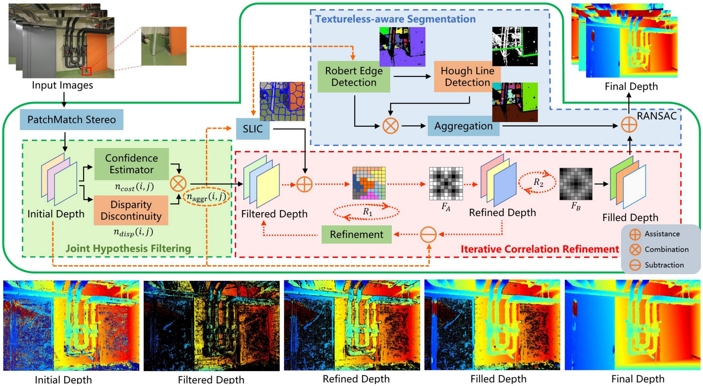

# TSAR-MVS

Zhenlong Yuan, Jiakai Cao, Zhaoxin Li, and Zhaoqi Wang, [**TSAR-MVS: Textureless-aware Segmentation and Correlative Refinement Guided Multi-View Stereo**](https://arxiv.org/pdf/2308.09990), Pattern Recogntion 2024.


## Introduction
TSAR-MVS is a universal algorithm that can be extended to most multi-view stereo(**MVS**) methods to further help them reconstruct textureless areas.

Our paper was accepted by **Pattern Recogntion 2024**!

If you find this project useful for your research, please cite:  

```
@article{yuan2024tsar,
  title={Tsar-mvs: Textureless-aware segmentation and correlative refinement guided multi-view stereo},
  author={Yuan, Zhenlong and Cao, Jiakai and Wang, Zhaoqi and Li, Zhaoxin},
  journal={Pattern Recognition},
  volume={154},
  pages={110565},
  year={2024},
  publisher={Elsevier}
}
```
## Requirements:
 - [Cuda](https://developer.nvidia.com/cuda-downloads) >= 6.0
 - Nvidia video card with compute capability at least 3.0, see https://en.wikipedia.org/wiki/CUDA#GPUs_supported
 - [Opencv](http://opencv.org) >= 2.4
 - [cmake](http://cmake.org)

## Environment used to develop:
- Ubuntu GNU/Linux 14.04 with nvidia gtx 980

## Tested Operating Systems
 - Ubuntu GNU/Linux 14.04 (use their repository for cuda sdk and nvidia drivers)
 - Windows with Visual Studio 2012/2013 (it's working directly with cmake)

## Tested GPUs (based on informal user reports)
 - GT720 (PASS, but 30X slower than Titan X)
 - GTX980 (PASS)
 - Titan X (PASS)
 - Quadro K4000 (PASS)

## How to compile it
Use cmake for both Windows and Linux.
For linux it gets as easy as:
```bash
cmake .
make
```

## How does it work?
Gipuma itself is only a matcher. It will compute a depthmap with respect to the specified reference camera.

For each camera gipuma computes the _noisy_ depthmap. The final fusion of depthmap is obtained with [fusibile](https://github.com/kysucix/fusibile)

Use a point cloud visualizer to open the resulting ply file.
[Meshlab](http://meshlab.sourceforge.net/) is probably the best visualizer
because it allows to render points cloud with normals.

## Examples
### Middlebury && ETH3D && TNT
 inside gipuma directory first download middlebury data:
 ```bash
 ./scripts/download-middlebury.sh
 ```
 Then run the model you prefer (see the list of available scripts inside the script folder).
 For example for the dino sparse ring:
 ```bash
 ./scripts/dinoSparseRing.sh
 ```
 It will fuse the dephmaps without considering point projecting on the image with an intensity lower than 15 (on a scale 0-255). The result should match the  middlebury benchmark submission (excluding [Poisson reconstruction](http://www.cs.jhu.edu/~misha/Code/PoissonRecon/))

## Acknowledgements

This code largely benefits from the following repositories: [ACMMP](https://github.com/GhiXu/ACMMP.git), [Gipuma](https://github.com/kysucix/gipuma). Thanks to their authors for opening the source of their excellent works.


